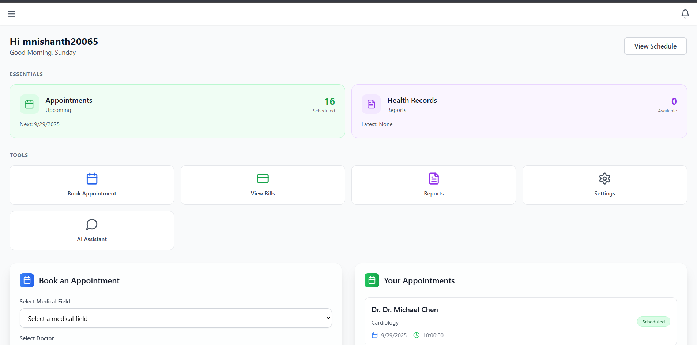
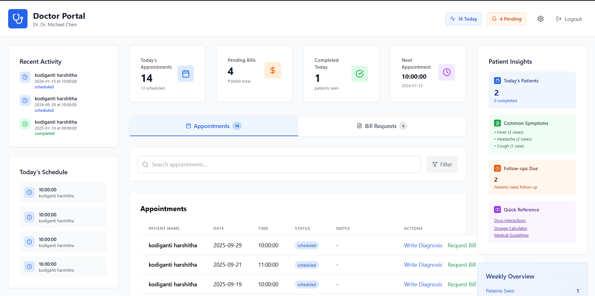
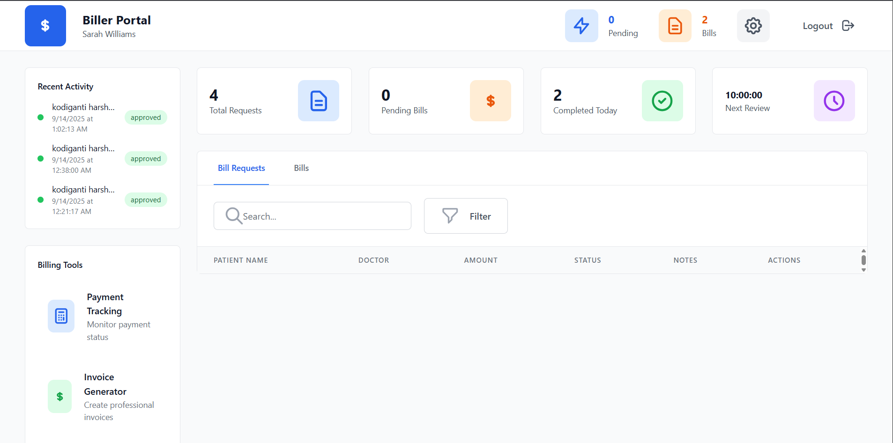

# 🏥 Hospital Management System

A comprehensive, modern hospital management platform built with React, TypeScript, and Supabase. This system streamlines the entire patient care journey from appointment booking to final billing and test results, featuring AI-powered assistance and role-based access control.

[](https://reactjs.org/)
[](https://www.typescriptlang.org/)
[](https://supabase.com/)
[](https://tailwindcss.com/)
[](https://vitejs.dev/)

## 🌟 Features

### 👥 Multi-Role User System
- **Patients** - Book appointments, view bills, access test results
- **Doctors** - Conduct consultations, generate bill requests, order tests
- **Billers** - Process payments, approve bills, generate invoices
- **Lab Technicians** - Process tests, generate results, create reports
- **Administrators** - System management and oversight

### 🤖 AI-Powered Healthcare Assistant
- **Symptom Assessment** - Analyze patient symptoms and provide guidance
- **Appointment Booking** - Natural language appointment scheduling
- **Test Result Explanation** - Explain medical results in simple terms
- **Emergency Triage** - Assess urgency and recommend appropriate care
- **Health Education** - Provide information about medical conditions
- **24/7 Availability** - Always accessible for patient queries

### 📅 Advanced Appointment Management
- **Real-Time Availability** - Check doctor availability before booking
- **AI-Powered Booking** - Chat with AI to book appointments naturally
- **Smart Scheduling** - Prevent double bookings with unique constraints
- **Appointment History** - Complete record of all patient visits
- **Status Tracking** - Monitor appointment progress through workflow

### 💰 Comprehensive Billing System
- **Automated Cost Calculation** - Consultation fees, disease costs, test pricing
- **Multi-Stage Approval** - Doctor requests → Biller approval → Patient invoicing
- **Payment Tracking** - Monitor payment status and methods
- **Transparent Pricing** - Clear breakdown of all charges
- **Receipt Generation** - Professional payment confirmations

### 🧪 Laboratory Management
- **Digital Test Processing** - Complete lab workflow automation
- **Test Ordering** - Doctors can order required laboratory tests
- **Result Generation** - Detailed test results and reports
- **Quality Control** - Ensure accuracy and reliability
- **Report Delivery** - Provide results to patients and doctors

### 📊 Patient Records Management
- **Complete Medical History** - All visits, tests, and treatments
- **Real-Time Updates** - Live information synchronization
- **Secure Data Storage** - Encrypted patient information
- **Access Control** - Role-based data permissions
- **Audit Trails** - Track all data access and modifications

## 🛠️ Tech Stack

### Frontend
- **React 18.3.1** - Modern React with hooks and functional components
- **TypeScript 5.5.3** - Type-safe JavaScript development
- **Vite 5.4.2** - Fast build tool and development server
- **React Router DOM 7.6.2** - Client-side routing
- **Tailwind CSS 3.4.1** - Utility-first CSS framework
- **Lucide React 0.344.0** - Beautiful icon library

### Backend & Database
- **Supabase 2.50.0** - Backend-as-a-Service (BaaS)
  - PostgreSQL database with real-time subscriptions
  - Row Level Security (RLS) for data protection
  - Built-in authentication system
  - Real-time data synchronization

### AI Integration
- **Google Gemini AI** - Advanced AI for healthcare assistance
- **Natural Language Processing** - Understand patient queries
- **Context-Aware Responses** - Intelligent conversation handling
- **Medical Knowledge Base** - Healthcare-specific AI training

### Development Tools
- **ESLint 9.9.1** - Code linting and quality assurance
- **TypeScript ESLint** - TypeScript-specific linting
- **PostCSS & Autoprefixer** - CSS processing and optimization

## 🚀 Quick Start

### Prerequisites
- Node.js (v16 or higher)
- npm or yarn
- Supabase account
- Google Gemini API key

### Installation

1. **Clone the repository**
   ```bash
   git clone https://github.com/Mariyada-Nishanth/Hospital-Management-System.git
   cd Hospital-Management-System
   ```

2. **Install dependencies**
   ```bash
   npm install
   ```

3. **Set up environment variables**
   Create a `.env.local` file in the root directory:
   ```env
   VITE_SUPABASE_URL=your_supabase_url
   VITE_SUPABASE_ANON_KEY=your_supabase_anon_key
   VITE_GEMINI_API_KEY=your_gemini_api_key
   ```

4. **Set up Supabase database**
   - Create a new Supabase project
   - Run the SQL migrations from `supabase/migrations/`
   - Set up Row Level Security policies

5. **Start the development server**
   ```bash
   npm run dev
   ```

6. **Open your browser**
   Navigate to `http://localhost:5173`

## 📁 Project Structure

```
Hospital-Management-System/
├── src/
│   ├── components/          # Reusable UI components
│   │   └── Chatbot.tsx      # AI healthcare assistant
│   ├── contexts/            # React context providers
│   │   └── AuthContext.tsx  # Authentication state management
│   ├── lib/                 # Utility functions and API calls
│   │   └── supabase.ts      # Database operations
│   ├── pages/               # Main application pages
│   │   ├── PatientDashboard.tsx    # Patient portal
│   │   ├── DoctorDashboard.tsx     # Doctor interface
│   │   ├── BillerDashboard.tsx     # Billing management
│   │   ├── LabDashboard.tsx        # Lab technician interface
│   │   └── StaffDashboard.tsx     # General staff interface
│   ├── types/               # TypeScript type definitions
│   │   └── database.ts      # Database schema types
│   └── App.tsx              # Main application component
├── supabase/
│   └── migrations/          # Database schema migrations
├── public/                  # Static assets
└── package.json            # Project dependencies
```

## 🔄 Complete Workflow

### Patient Journey
1. **Registration** → Create account and provide information
2. **Appointment Booking** → Schedule with preferred doctor (manual or AI)
3. **Consultation** → Meet with doctor for examination
4. **Test Orders** → Doctor orders necessary laboratory tests
5. **Billing** → Receive bill for consultation and tests
6. **Payment** → Pay for services rendered
7. **Results** → Access test results and reports
8. **Follow-up** → Schedule additional appointments if needed

### Doctor Workflow
1. **Patient Review** → Access patient medical history
2. **Consultation** → Conduct examination and diagnosis
3. **Test Ordering** → Request necessary laboratory tests
4. **Billing** → Generate bill request for services
5. **Documentation** → Record consultation notes and findings

### Billing Process
1. **Request Review** → Examine doctor-generated bill requests
2. **Approval** → Approve or modify billing requests
3. **Invoice Creation** → Generate final bills for patients
4. **Payment Tracking** → Monitor payment status
5. **Receipt Generation** → Provide payment confirmations

### Laboratory Process
1. **Test Receipt** → Receive approved test orders
2. **Sample Collection** → Collect patient samples
3. **Processing** → Perform laboratory tests
4. **Result Generation** → Create detailed test results
5. **Report Delivery** → Provide results to patients and doctors

## 🛡️ Security Features

- **Row Level Security (RLS)** - Database-level access control
- **Role-Based Access Control** - User permissions based on roles
- **Encrypted Data Storage** - All sensitive data encrypted
- **Audit Logging** - Complete activity tracking
- **Secure Authentication** - Supabase Auth with JWT tokens
- **HIPAA Compliance** - Healthcare data protection standards

## 🤖 AI Features

### Intelligent Chatbot
- **Natural Language Understanding** - Process complex patient queries
- **Context Awareness** - Remember conversation history
- **Medical Knowledge** - Healthcare-specific responses
- **Emergency Assessment** - Triage patient urgency levels
- **Appointment Integration** - Book appointments through conversation

### Smart Automation
- **Cost Calculation** - Automatic billing calculations
- **Availability Checking** - Real-time appointment availability
- **Test Recommendations** - Suggest appropriate tests
- **Result Interpretation** - Explain medical results
- **Follow-up Suggestions** - Recommend next steps

## 📱 Responsive Design

- **Mobile-First** - Optimized for mobile devices
- **Cross-Platform** - Works on desktop, tablet, and mobile
- **Accessibility** - Supports users with different abilities
- **Modern UI** - Clean, professional medical interface
- **Real-Time Updates** - Live data synchronization

## 🔧 Available Scripts

```bash
# Development
npm run dev          # Start development server
npm run build        # Build for production
npm run preview      # Preview production build
npm run lint         # Run ESLint

# Database
npm run db:reset     # Reset database
npm run db:seed      # Seed with sample data
```

## 🌐 Live Demo

[View Live Demo](https://your-demo-url.com) - *Coming Soon*

## 📸 Screenshots

### Patient Dashboard


### Doctor Interface


### Lab Technician Dashboard 


### Billing System


## 🤝 Contributing

We welcome contributions! Please see our [Contributing Guidelines](CONTRIBUTING.md) for details.

1. Fork the repository
2. Create a feature branch (`git checkout -b feature/amazing-feature`)
3. Commit your changes (`git commit -m 'Add amazing feature'`)
4. Push to the branch (`git push origin feature/amazing-feature`)
5. Open a Pull Request

## 📝 License

This project is licensed under the MIT License - see the [LICENSE](LICENSE) file for details.

## 👨‍💻 Author

**Mariyada Nishanth**
- GitHub: [@Mariyada-Nishanth](https://github.com/Mariyada-Nishanth)
- Email: your-email@example.com

## 🙏 Acknowledgments

- [Supabase](https://supabase.com/) for the amazing backend platform
- [Google Gemini](https://ai.google.dev/) for AI capabilities
- [React](https://reactjs.org/) and [TypeScript](https://www.typescriptlang.org/) communities
- [Tailwind CSS](https://tailwindcss.com/) for the utility-first CSS framework
- [Lucide](https://lucide.dev/) for the beautiful icons

## 📊 Project Stats


---

⭐ **Star this repository if you found it helpful!**

🔗 **Connect with me on [LinkedIn](https://linkedin.com/in/your-profile)**
